# Spring Boot REST API Collection

A collection of six Spring Boot REST APIs demonstrating various CRUD operations and domain-specific functionalities.

## Projects Overview

| Project | Port | Description |
|---------|------|-------------|
| [Library API](#1-library-api) | 8082 | Book management system |
| [Student API](#2-student-api) | 8081 | Student registration and information management |
| [Restaurant Menu API](#3-restaurant-menu-api) | 8083 | Restaurant menu item management |
| [E-Commerce API](#4-e-commerce-api) | 8084 | Product catalog with advanced filtering |
| [Task Management API](#5-task-management-api) | 8085 | Task tracking with priority levels |
| [User Profile API](#6-user-profile-api) | 8086 | User profile management |

## Technologies

- **Spring Boot** 4.0.2
- **Java** 17
- **Maven** Build Tool

## Running a Project

Navigate to any project directory and run:

```bash
mvnw.cmd spring-boot:run
```

Or on Unix/Linux/Mac:

```bash
./mvnw spring-boot:run
```

---

## 1. Library API

**Port:** 8082  
**Location:** `question1-library-api/`

Manages library books with search and CRUD operations.

### Key Features
- Get all books
- Search by title
- Add/delete books
- Get book by ID

### Sample Endpoints

**Get All Books**
```
GET /api/books
```


**Get Book by ID**
```
GET /api/books/{id}
```


**Search by Title**
```
GET /api/books/search?title={title}
```
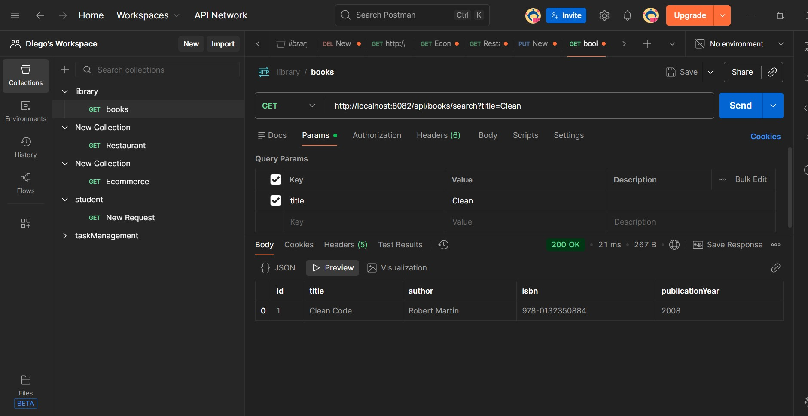

**Add New Book**
```
POST /api/books
```


**Delete Book**
```
DELETE /api/books/{id}
```


---

## 2. Student API

**Port:** 8081  
**Location:** `question2-student-api/`

Student registration system with filtering capabilities.

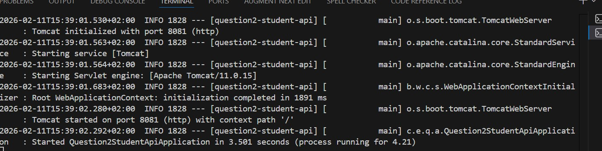

### Key Features
- Student registration
- Filter by major
- Filter by GPA
- Update student information

### Sample Endpoints

**Get All Students**
```
GET /api/students
```


**Get Student by ID**
```
GET /api/students/{id}
```


**Filter by Major**
```
GET /api/students/major/{major}
```


**Register New Student**
```
POST /api/students
```


**Update Student**
```
PUT /api/students/{id}
```
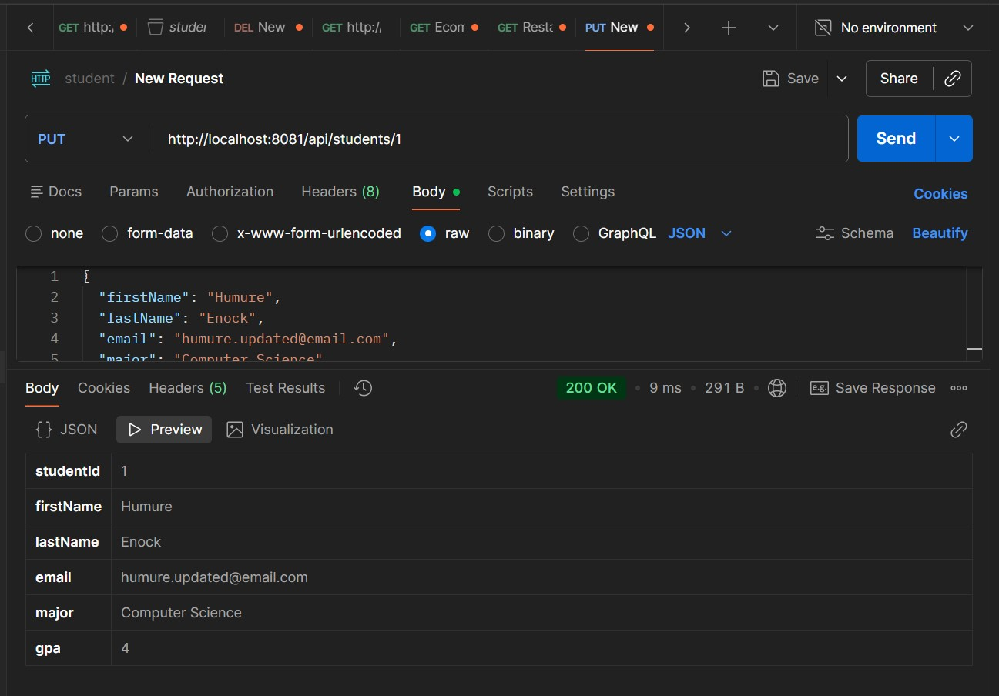

---

## 3. Restaurant Menu API

**Port:** 8083  
**Location:** `question3-restaurant-api/`

Restaurant menu management with category filtering and availability tracking.


### Key Features
- Menu item management
- Filter by category
- Toggle availability
- Search by name

### Sample Endpoints

**Get All Menu Items**
```
GET /api/menu
```


**Get Item by ID**
```
GET /api/menu/{id}
```


**Filter by Category**
```
GET /api/menu/category/{category}
```


**Get Available Items**
```
GET /api/menu/available?available={true/false}
```


**Search by Name**
```
GET /api/menu/search?name={name}
```


**Add Menu Item**
```
POST /api/menu
```


**Toggle Availability**
```
PUT /api/menu/{id}/availability
```
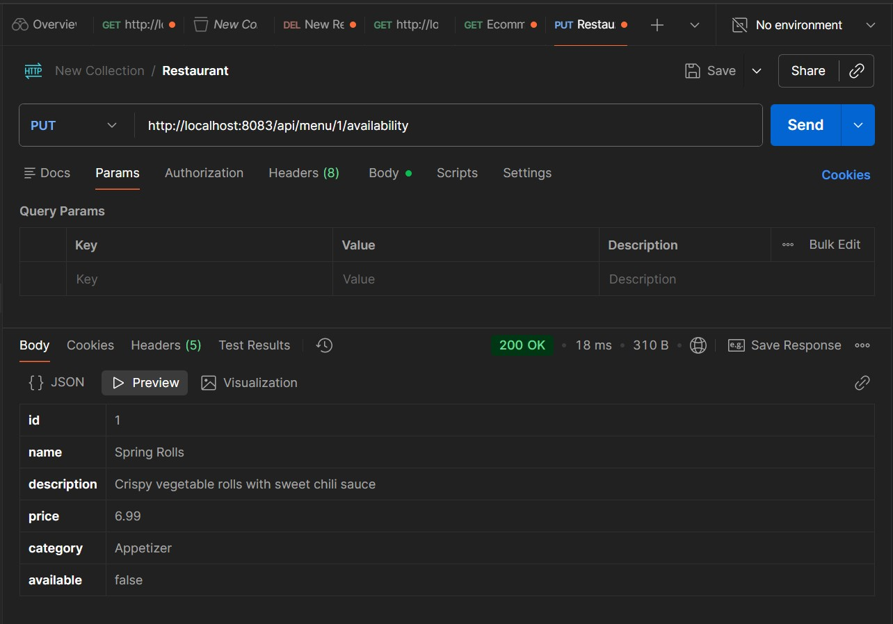

**Delete Menu Item**
```
DELETE /api/menu/{id}
```
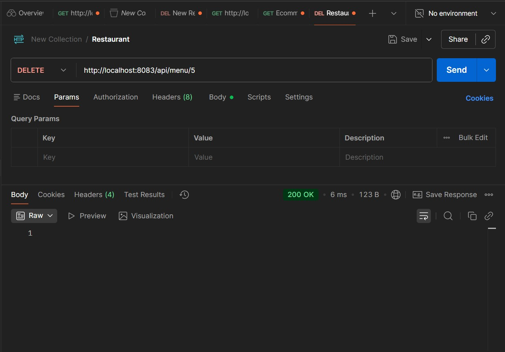

---

## 4. E-Commerce API

**Port:** 8084  
**Location:** `question4-Ecommerce-api/`

Product catalog with advanced filtering, pagination, and search.

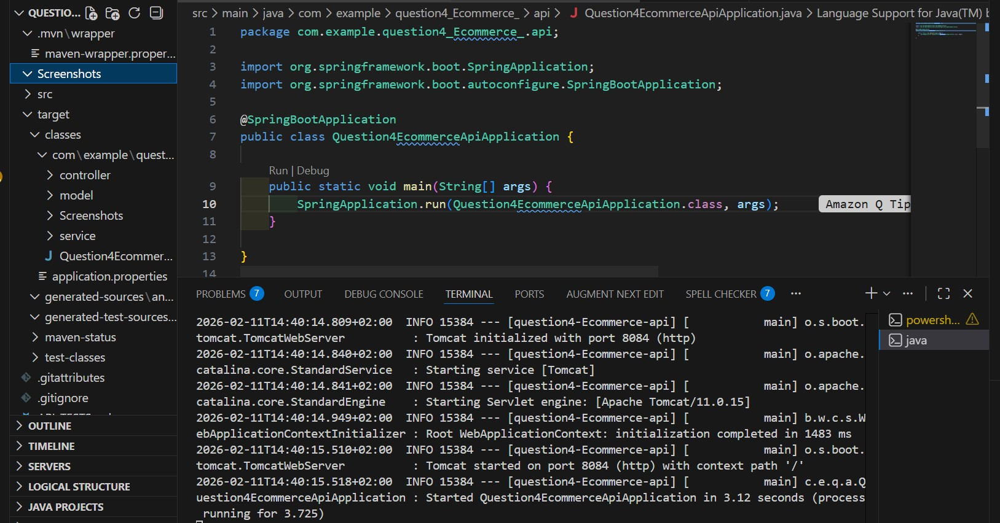

### Key Features
- Product CRUD operations
- Pagination support
- Filter by category, brand, price range
- Stock management
- Keyword search

### Sample Endpoints

**Get All Products**
```
GET /api/products
```


**Get Products with Pagination**
```
GET /api/products?page={page}&limit={limit}
```


**Get Product by ID**
```
GET /api/products/{id}
```


**Filter by Category**
```
GET /api/products/category/{category}
```


**Filter by Brand**
```
GET /api/products/brand/{brand}
```


**Filter by Price Range**
```
GET /api/products/price-range?min={min}&max={max}
```


**Get In-Stock Products**
```
GET /api/products/in-stock
```
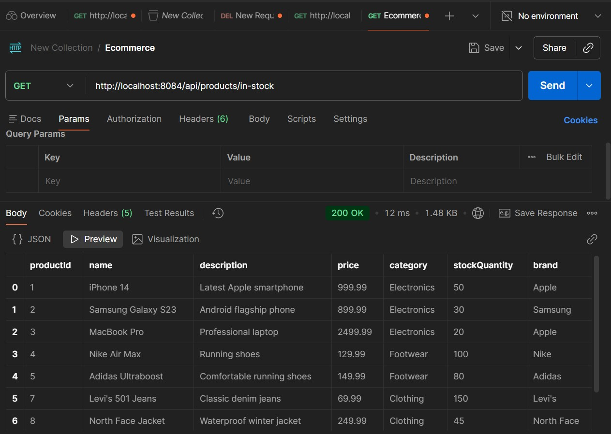

**Search Products**
```
GET /api/products/search?keyword={keyword}
```


**Create New Product**
```
POST /api/products
```


**Update Product**
```
PUT /api/products/{id}
```


**Delete Product**
```
DELETE /api/products/{id}
```
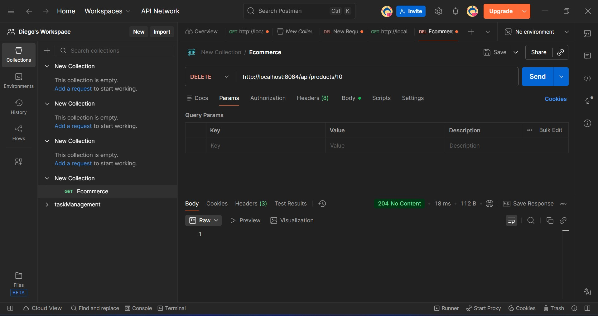

---

## 5. Task Management API

**Port:** 8085  
**Location:** `question5-taskManagement-api/`

Task tracking system with priority levels and completion status.


### Key Features
- Task CRUD operations
- Filter by completion status
- Filter by priority (LOW, MEDIUM, HIGH)
- Mark tasks as completed

### Sample Endpoints

**Get All Tasks**
```
GET /api/tasks
```


**Get Task by ID**
```
GET /api/tasks/{id}
```


**Filter by Completion Status**
```
GET /api/tasks/status?completed={true/false}
```


**Filter by Priority**
```
GET /api/tasks/priority/{priority}
```


**Create New Task**
```
POST /api/tasks
```
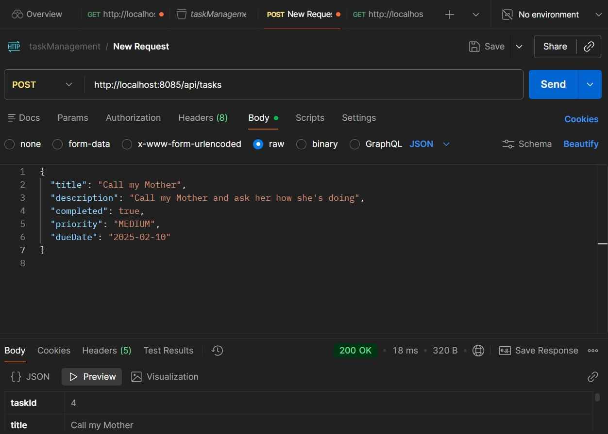

**Update Task**
```
PUT /api/tasks/{id}
```


**Mark Task as Completed**
```
PATCH /api/tasks/{id}/complete
```


**Delete Task**
```
DELETE /api/tasks/{id}
```


---

## 6. User Profile API

**Port:** 8086  
**Location:** `question6-userProfile-api/`

User profile management with activation/deactivation capabilities.

### Key Features
- User CRUD operations
- Profile management
- User activation/deactivation

### Sample Endpoints

**Create User**
```
POST /api/users
```


**Update User**
```
PUT /api/users/{id}
```
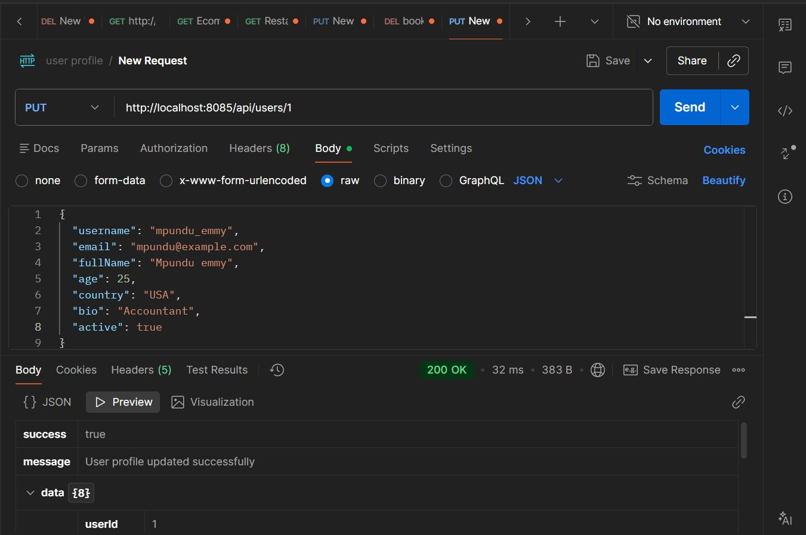

**Delete User**
```
DELETE /api/users/{id}
```
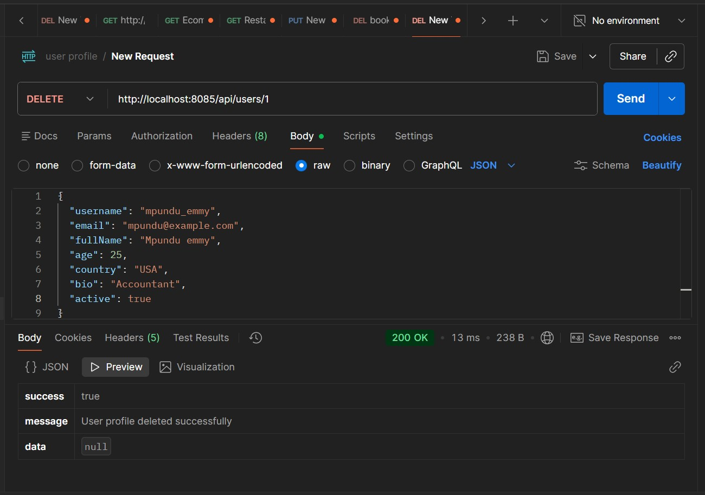

---

## Project Structure

Each project follows standard Spring Boot architecture:

```
project-name/
├── src/
│   ├── main/
│   │   ├── java/
│   │   │   └── com/example/
│   │   │       ├── model/
│   │   │       ├── service/
│   │   │       └── controller/
│   │   └── resources/
│   └── test/
├── Screenshots/
├── pom.xml
└── README.md
```

## API Testing

All endpoints have been tested using Postman. Screenshots of API responses are included above for each endpoint.

## License

Educational project collection.
