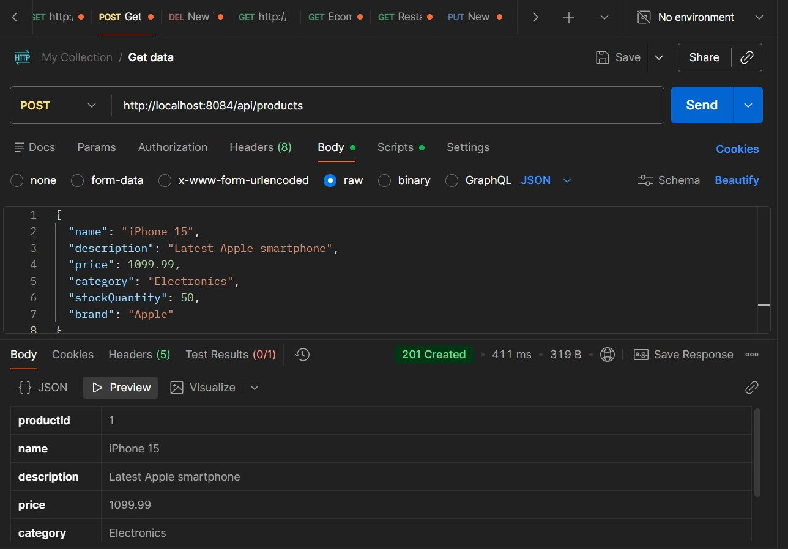
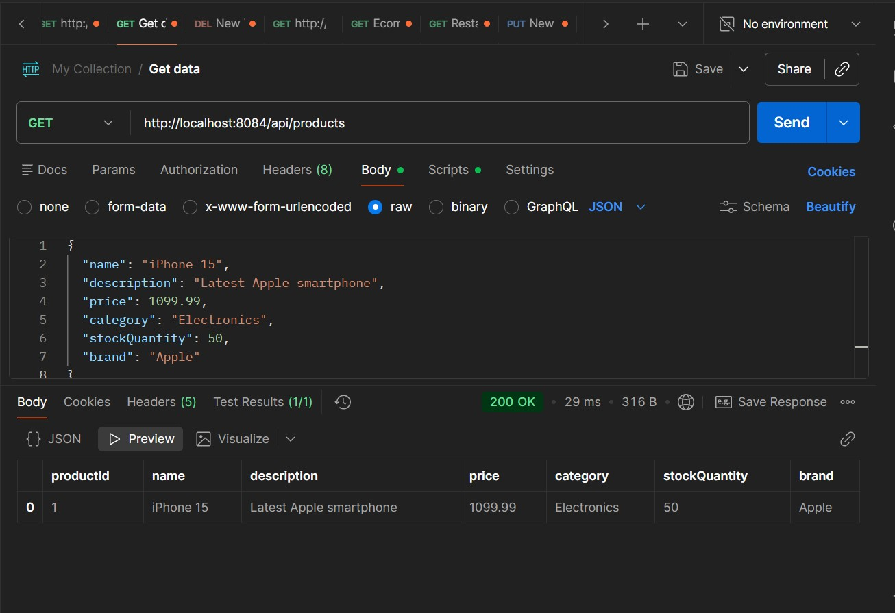
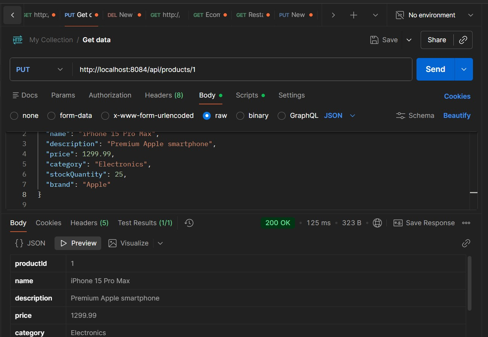
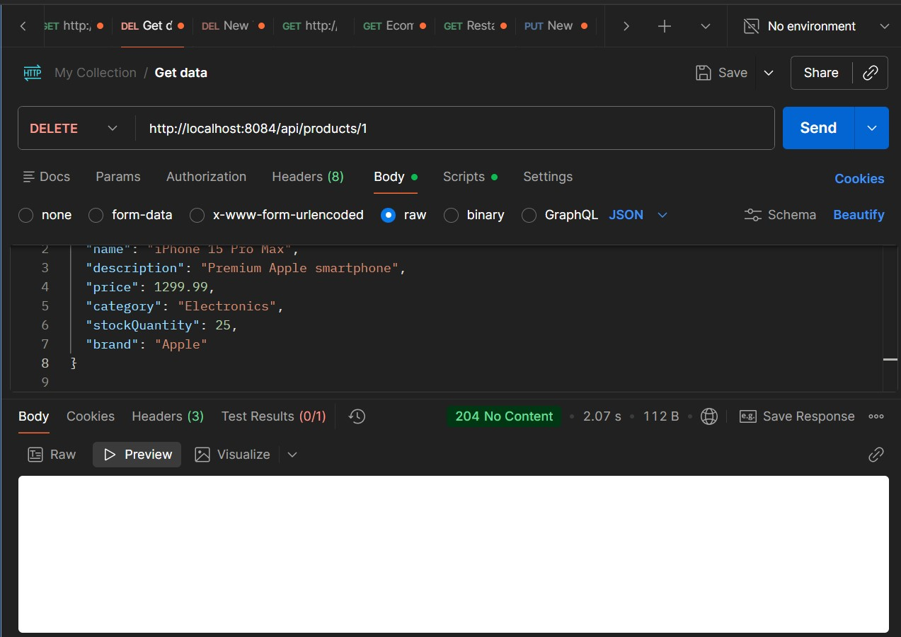

# E-Commerce Product API

**Name:** Gaju Diego  
**Student ID:** 27395

**Port:** 8084  
**Database:** ecommerce_db

A Spring Boot REST API for managing e-commerce products with full CRUD operations and PostgreSQL database integration.

## Technologies

- **Spring Boot** 4.0.2
- **Java** 17
- **PostgreSQL** Database
- **Maven** Build Tool

## Database Setup

Create PostgreSQL database:
```sql
CREATE DATABASE ecommerce_db;
```

## Running the Application

```bash
mvnw.cmd spring-boot:run
```

Application runs on: **http://localhost:8084**

---

## CRUD Operations

### CREATE - Add New Product

**POST** `/api/products`

```json
{
  "name": "iPhone 15",
  "description": "Latest Apple smartphone",
  "price": 1099.99,
  "category": "Electronics",
  "stockQuantity": 50,
  "brand": "Apple"
}
```



**Verify in Database:**


---

### READ - Get Products

**GET** `/api/products`

**GET** `/api/products/{id}`



---

### UPDATE - Modify Product

**PUT** `/api/products/{id}`

```json
{
  "name": "iPhone 15 Pro",
  "description": "Premium Apple smartphone",
  "price": 1299.99,
  "category": "Electronics",
  "stockQuantity": 30,
  "brand": "Apple"
}
```



**Verify in Database:**


---

### DELETE - Remove Product

**DELETE** `/api/products/{id}`



---

## API Endpoints Summary

| Method | Endpoint | Description |
|--------|----------|-------------|
| POST | `/api/products` | Create new product |
| GET | `/api/products` | Get all products |
| GET | `/api/products/{id}` | Get product by ID |
| PUT | `/api/products/{id}` | Update product |
| DELETE | `/api/products/{id}` | Delete product |

---

## Database Schema

**Table:** `products`

| Column | Type | Description |
|--------|------|-------------|
| product_id | BIGSERIAL | Primary Key (Auto-generated) |
| name | VARCHAR | Product name |
| description | VARCHAR | Product description |
| price | DOUBLE | Product price |
| category | VARCHAR | Product category |
| stock_quantity | INTEGER | Available stock |
| brand | VARCHAR | Product brand |

---

## Project Structure

```
src/main/java/com/example/question4_Ecommerce_/api/
├── model/
│   ├── Product.java (Entity)
│   └── ProductRepository.java (Repository)
├── service/
│   └── ProductService.java (Business Logic)
└── controller/
    └── ProductController.java (REST Endpoints)
```

## Features

✅ Full CRUD Operations  
✅ PostgreSQL Database Integration  
✅ Advanced Filtering (Category, Brand, Price Range)  
✅ RESTful API Design
