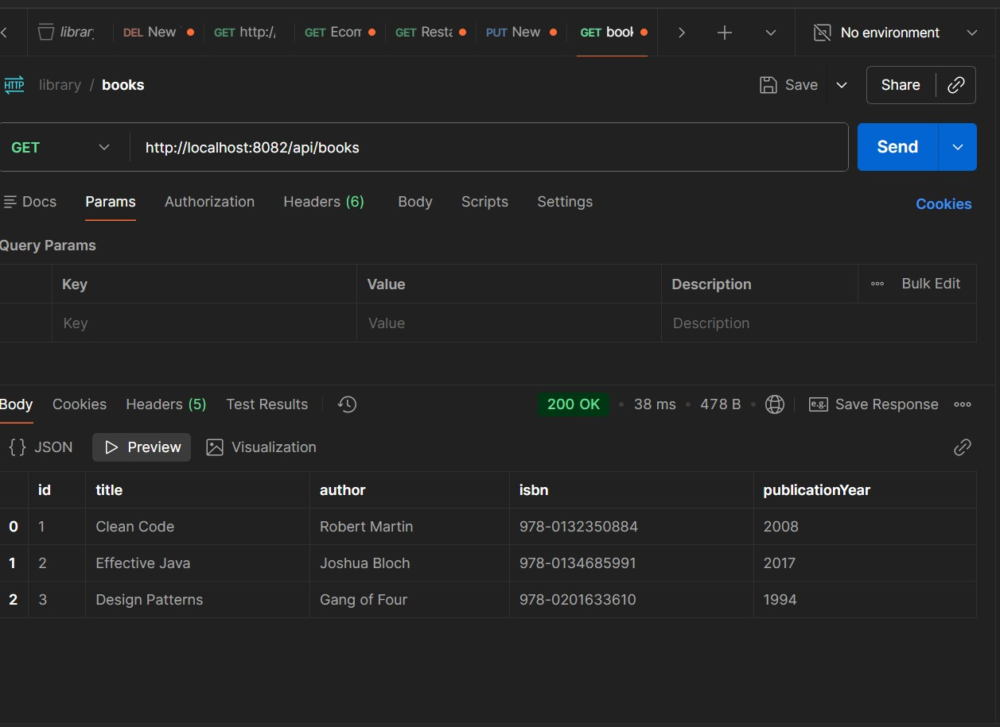

# Library Book Management API

A Spring Boot REST API for managing library books.

## Setup

1. Run the application:
```bash
mvnw.cmd spring-boot:run
```

2. API runs on: `http://localhost:8082`

## API Endpoints

### Get All Books
```
GET http://localhost:8082/api/books
```


### Get Book by ID
```
GET http://localhost:8082/api/books/1
```


### Search Books by Title
```
GET http://localhost:8082/api/books/search?title=Clean
```


### Add New Book
```
POST http://localhost:8082/api/books

```

**Response (201 Created):** Returns the created book.

### Delete Book
```
DELETE http://localhost:8082/api/books/1
```


**Response (404 Not Found):** Book not found.

## Sample Books Included

1. Clean Code - Robert Martin (2008)
2. Effective Java - Joshua Bloch (2017)
3. Design Patterns - Gang of Four (1994)

