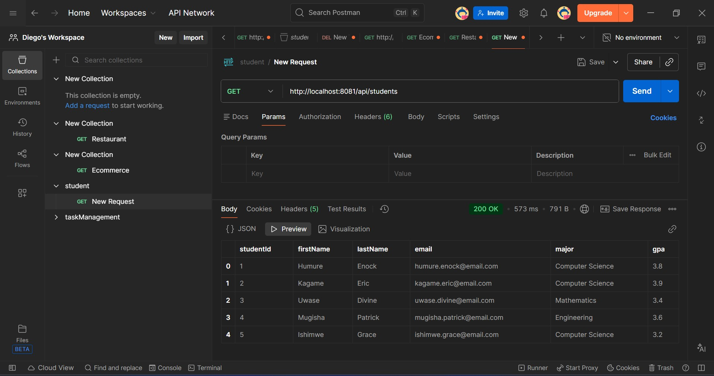

# Question 2: Student Registration API

REST API for student registration and information management.

## Running

```bash
.\mvnw.cmd spring-boot:run
```

Application runs on: `http://localhost:8081`

## API Endpoints

### GET /api/students
Get all students
```
http://localhost:8081/api/students
```

### GET /api/students/{studentId}
Get student by ID
```
http://localhost:8081/api/students/1
```

### GET /api/students/major/{major}
Get students by major
```
http://localhost:8081/api/students/major/Computer Science
```


### POST /api/students
Register new student
```bash
POST http://localhost:8081/api/students 
```

### PUT /api/students/{studentId}
Update student information
```bash
PUT http://localhost:8081/api/students/1
```


## Testing Scenarios

1. **Filter by Computer Science major:**
   ```
   http://localhost:8081/api/students/major/Computer Science
   ```
 

2. **Filter students with GPA >= 3.5:**
   ```
   http://localhost:8081/api/students/filter?gpa=3.5
   ```