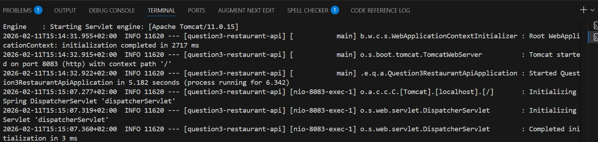
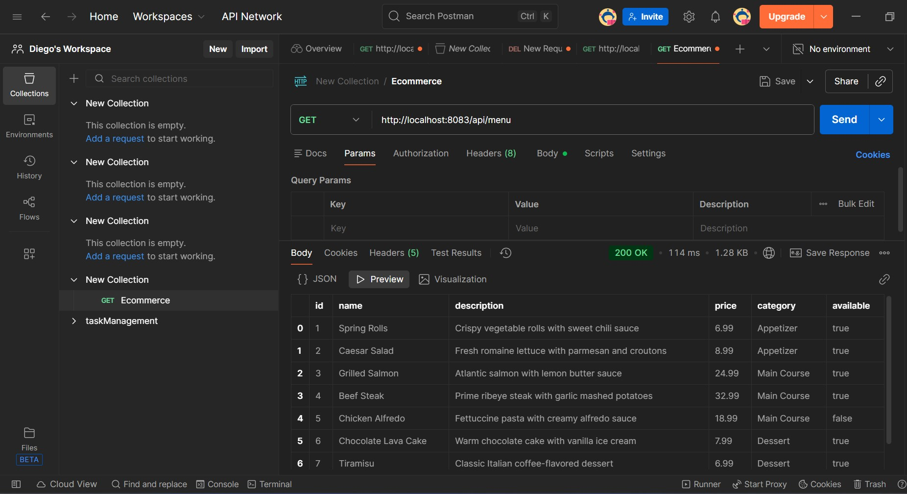
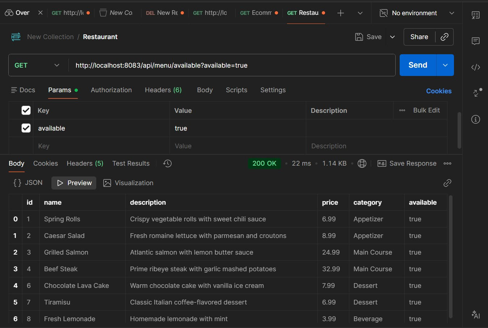

# Restaurant Menu API

A Spring Boot REST API for managing restaurant menu items.

## Setup

1. Run the application:
```bash
mvnw.cmd spring-boot:run
```


2. API runs on: `http://localhost:8083`

## API Endpoints

### Get All Menu Items
```
GET http://localhost:8083/api/menu
```

### Get Menu Item by ID
```
GET http://localhost:8083/api/menu/1
```

### Get Items by Category
```
GET http://localhost:8083/api/menu/category/Appetizer
GET http://localhost:8083/api/menu/category/Main%20Course
GET http://localhost:8083/api/menu/category/Dessert
GET http://localhost:8083/api/menu/category/Beverage
```

### Get Available Items
```
GET http://localhost:8083/api/menu/available?available=true
GET http://localhost:8083/api/menu/available?available=false
```

### Search by Name
```
GET http://localhost:8083/api/menu/search?name=Salmon
```

### Add Menu Item
```
POST http://localhost:8083/api/menu

```

### Toggle Availability
```
PUT http://localhost:8083/api/menu/1/availability
```

### Delete Menu Item
```
DELETE http://localhost:8083/api/menu/1
```


