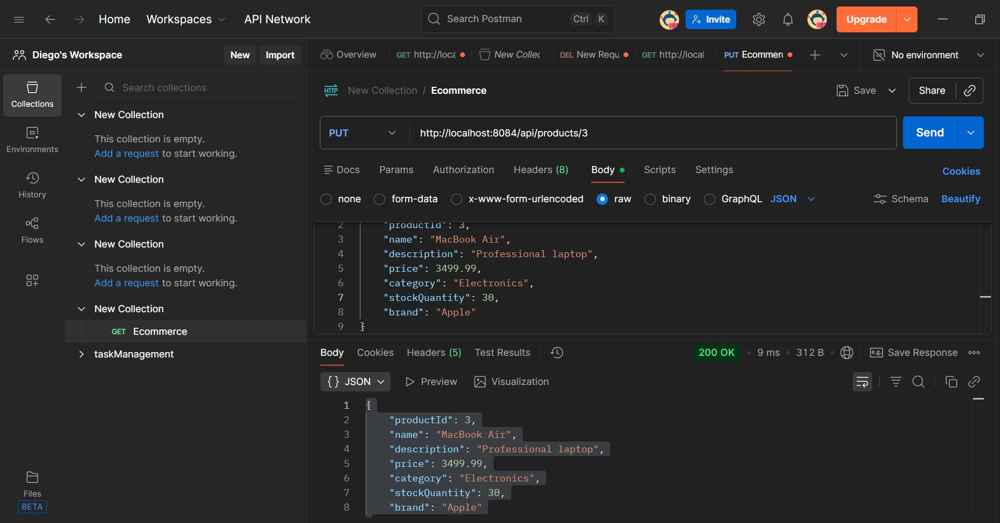

# Question 4: E-Commerce Product API

## Application running
1. Navigate to the project directory
2. Run: `.\\mvnw.cmd spring-boot:run`
3. Application will start on `http://localhost:8084`


## API Endpoints

### 1. Get All Products
- **Endpoint**: `GET /api/products`
- **Description**: Retrieve all products
- **Sample Request**: `GET http://localhost:8084/api/products`


### 2. Get All Products with Pagination
- **Endpoint**: `GET /api/products?page={page}&limit={limit}`
- **Description**: Retrieve products with pagination
- **Sample Request**: `GET http://localhost:8084/api/products?page=0&limit=5`


### 3. Get Product by ID
- **Endpoint**: `GET /api/products/{productId}`
- **Description**: Retrieve a specific product by ID
- **Sample Request**: `GET http://localhost:8084/api/products/1`


### 4. Get Products by Category
- **Endpoint**: `GET /api/products/category/{category}`
- **Description**: Filter products by category
- **Sample Request**: `GET http://localhost:8084/api/products/category/Electronics`


### 5. Get Products by Brand
- **Endpoint**: `GET /api/products/brand/{brand}`
- **Description**: Filter products by brand
- **Sample Request**: `GET http://localhost:8084/api/products/brand/Apple`


### 6. Search Products
- **Endpoint**: `GET /api/products/search?keyword={keyword}`
- **Description**: Search products by keyword in name or description
- **Sample Request**: `GET http://localhost:8084/api/products/search?keyword=laptop`

### 7. Get Products by Price Range
- **Endpoint**: `GET /api/products/price-range?min={min}&max={max}`
- **Description**: Filter products within a price range
- **Sample Request**: `GET http://localhost:8084/api/products/price-range?min=100&max=500`

### 8. Get In-Stock Products
- **Endpoint**: `GET /api/products/in-stock`
- **Description**: Retrieve products with stock quantity > 0
- **Sample Request**: `GET http://localhost:8084/api/products/in-stock`

### 9. Create New Product
- **Endpoint**: `POST /api/products`
- **Description**: Add a new product
- **Sample Request**: `POST http://localhost:8084/api/products`


### 10. Update Product
- **Endpoint**: `PUT /api/products/{productId}`
- **Description**: Update an existing product
- **Sample Request**: `PUT http://localhost:8084/api/products/1`


### 12. Delete Product
- **Endpoint**: `DELETE /api/products/{productId}`
- **Description**: Delete a product
- **Sample Request**: `DELETE http://localhost:8084/api/products/10`
- **Sample Response**: `204 No Content`

## Sample Products (10 pre-loaded)
1. iPhone 14 - Apple - Electronics - $999.99 - Stock: 50
2. Samsung Galaxy S23 - Samsung - Electronics - $899.99 - Stock: 30
3. MacBook Pro - Apple - Electronics - $2499.99 - Stock: 20
4. Nike Air Max - Nike - Footwear - $129.99 - Stock: 100
5. Adidas Ultraboost - Adidas - Footwear - $149.99 - Stock: 80
6. Sony WH-1000XM5 - Sony - Electronics - $399.99 - Stock: 0 (Out of stock)
7. Levi's 501 Jeans - Levi's - Clothing - $69.99 - Stock: 150
8. North Face Jacket - North Face - Clothing - $249.99 - Stock: 45
9. Dell XPS 13 - Dell - Electronics - $1299.99 - Stock: 25
10. Puma Sneakers - Puma - Footwear - $79.99 - Stock: 120

## Project Structure
```
src/main/java/com/example/question4_Ecommerce_/api/
├── Question4EcommerceApiApplication.java (Main Application)
├── model/
│   └── Product.java (Model)
├── service/
│   └── ProductService.java (Service)
└── controller/
    └── ProductController.java (Controller)
```

## Technologies Used
- Spring Boot 4.0.2
- Java 17
- Maven
