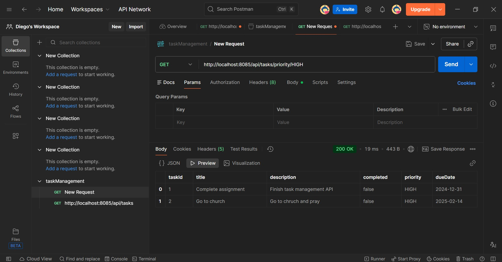
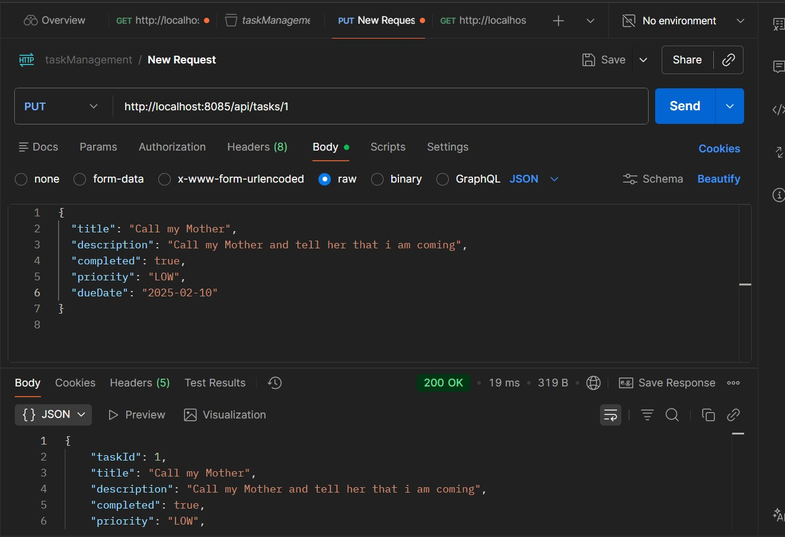
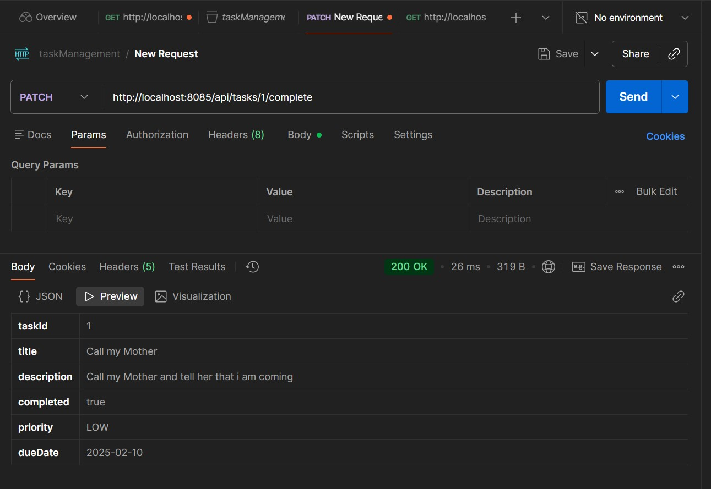
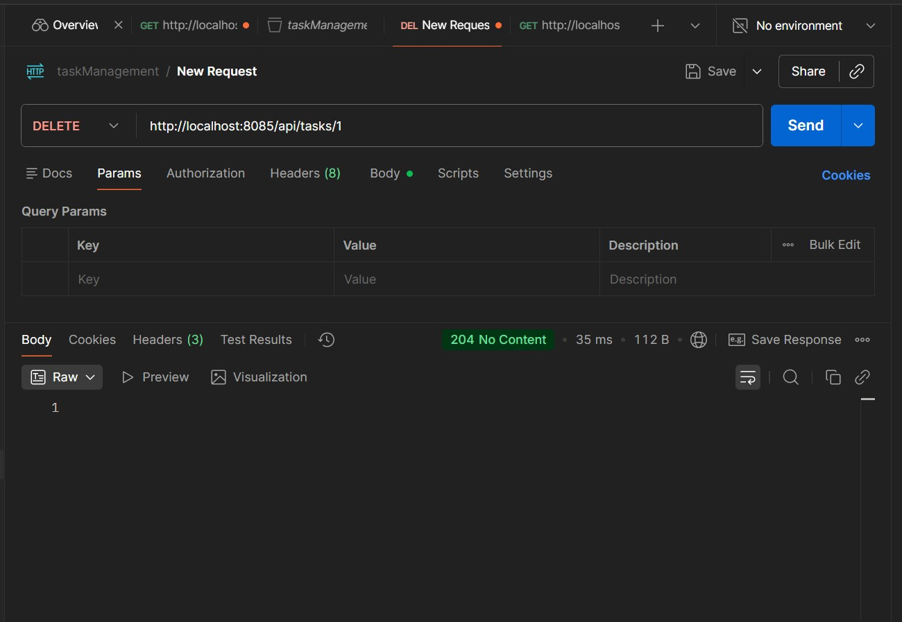

# Question 5: Task Management API

## Application running

1. Navigate to the project directory
2. Run: `.\mvnw.cmd spring-boot:run`
3. Application will start on `http://localhost:8085`

## API Endpoints

### 1. Get All Tasks
- **Endpoint**: `GET /api/tasks`
- **Description**: Retrieve all tasks
- **Sample Request**: `GET http://localhost:8085/api/tasks`
- **Sample Response**:


### 2. Get Task by ID
- **Endpoint**: `GET /api/tasks/{taskId}`
- **Description**: Retrieve a specific task by ID
- **Sample Request**: `GET http://localhost:8085/api/tasks/1`
- **Sample Response**:


### 3. Get Tasks by Completion Status
- **Endpoint**: `GET /api/tasks/status?completed={true/false}`
- **Description**: Filter tasks by completion status
- **Sample Request**: `GET http://localhost:8085/api/tasks/status?completed=false`
- **Sample Response**:


### 4. Get Tasks by Priority
- **Endpoint**: `GET /api/tasks/priority/{priority}`
- **Description**: Filter tasks by priority (LOW, MEDIUM, HIGH)
- **Sample Request**: `GET http://localhost:8085/api/tasks/priority/HIGH`
- **Sample Response**:


### 5. Create New Task
- **Endpoint**: `POST /api/tasks`
- **Description**: Create a new task
- **Sample Request**: `POST http://localhost:8085/api/tasks`
- **Request Body**:


### 6. Update Task
- **Endpoint**: `PUT /api/tasks/{taskId}`
- **Description**: Update an existing task
- **Sample Request**: `PUT http://localhost:8085/api/tasks/1`
- **Request Body**:


### 7. Mark Task as Completed
- **Endpoint**: `PATCH /api/tasks/{taskId}/complete`
- **Description**: Mark a task as completed
- **Sample Request**: `PATCH http://localhost:8085/api/tasks/1/complete`
- **Sample Response**:


### 8. Delete Task
- **Endpoint**: `DELETE /api/tasks/{taskId}`
- **Description**: Delete a task
- **Sample Request**: `DELETE http://localhost:8085/api/tasks/1`
- **Sample Response**: `204 No Content`

## Project Structure
```
src/main/java/com/example/question5_taskManagement_/api/
├── Question5TaskManagementApiApplication.java (Main Application)
├── Task.java (Model)
└── TaskController.java (Controller)
```

## Technologies Used
- Spring Boot 4.0.2
- Java 17
- Maven
