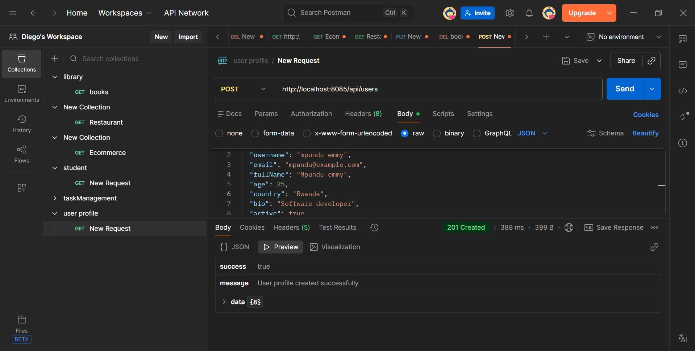

# User Profile API

A comprehensive REST API for managing user profiles with CRUD operations, search functionality, and user activation/deactivation.

## Running the Application

```bash
mvnw spring-boot:run
```

The API runs on **http://localhost:8085**

## API Endpoints

### Create User
**POST** `/api/users`

```


```

### Update User
**PUT** `/api/users/{id}`

### Delete User
**DELETE** `/api/users/{id}`


## Technologies

- Spring Boot 4.0.2
- Java 17
- Maven
